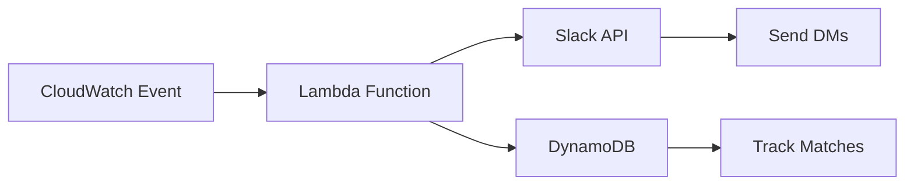

<div align="center">

# 👋 new-starters-meetup

> **Automated Slack introductions for new team members - Schedule virtual coffee chats and team meetups**


[Features](#-features) • [Quick Start](#-quick-start) • [Configuration](#️-configuration) • [Contributing](#-contributing)

</div>

---


## ✨ Features

| Feature | Description |
|---------|-------------|
| 🤖 **Automated Introductions** | Auto-detect new hires and send welcome messages |
| ☕ **Coffee Chat Scheduling** | Schedule random 1:1 introductions with team members |
| 📅 **Calendar Integration** | Check availability before scheduling |
| 🎯 **Smart Matching** | Match new starters with relevant team members |
| 📊 **Analytics** | Track engagement and participation |
| ⚡ **Serverless** | AWS Lambda for cost-effective scaling |
| 🔔 **Reminders** | Send follow-up reminders for scheduled meetups |

---

## 📋 Prerequisites

| Requirement | Version |
|-------------|---------|
| Python | 3.11+ |
| AWS Account | With Lambda access |
| Slack App | With Bot Token |
| Slack Workspace | Admin access for app installation |

---

## 🚀 Quick Start

### 1. Clone the Repository

```bash
git clone https://github.com/CaputoDavide93/new-starters-meetup.git
cd new-starters-meetup
```

### 2. Configure Environment

```bash
cp .env.example .env
# Edit .env with your settings
```

### 3. Install Dependencies

```bash
pip install -r requirements.txt
```

### 4. Deploy to AWS

```bash
cd deploy
./deploy.sh
```

---

## ☁️ AWS Deployment

### Lambda Function Setup

```bash
# Package the Lambda function
cd Layer
zip -r lambda_layer.zip python/

# Deploy using AWS CLI
aws lambda publish-layer-version \
  --layer-name newstarters-deps \
  --zip-file fileb://lambda_layer.zip
```

### CloudWatch Event Rule

Schedule the function to run periodically:

```json
{
  "schedule": "cron(0 9 ? * MON-FRI *)"
}
```

---

## ⚙️ Configuration

### Environment Variables

| Variable | Description | Required |
|----------|-------------|----------|
| `SLACK_BOT_TOKEN` | Slack Bot OAuth token | ✅ |
| `SLACK_SIGNING_SECRET` | Slack app signing secret | ✅ |
| `SLACK_CHANNEL_ID` | Channel for introductions | ✅ |
| `NEW_HIRE_CHANNEL` | New hire tracking channel | ✅ |
| `MATCHING_ALGORITHM` | Matching strategy | ❌ |
| `INTRO_DELAY_DAYS` | Days before first intro | ❌ |

### Slack App Permissions

Required Bot Token Scopes:

```
channels:read
chat:write
users:read
users:read.email
im:write
```

### Configuration File

```yaml
# config.yaml
slack:
  bot_token: "${SLACK_BOT_TOKEN}"
  channel: "#new-starters"
  
matching:
  algorithm: "random"  # or "department", "role"
  max_matches: 3
  delay_days: 2

messages:
  welcome: "👋 Welcome to the team, {name}!"
  intro_request: "☕ Time for a virtual coffee chat?"
```

---

## 📖 Usage

### Manual Trigger

```bash
python src/main.py --trigger-now
```

### Test Mode

```bash
python src/main.py --dry-run
```

### View Pending Introductions

```bash
python src/main.py --list-pending
```

---

## 🔧 Architecture



### Project Structure

```
new-starters-meetup/
├── src/
│   ├── main.py           # Entry point
│   ├── slack_client.py   # Slack API wrapper
│   ├── matcher.py        # Matching algorithm
│   └── scheduler.py      # Meetup scheduling
├── Layer/
│   └── python/           # Lambda dependencies
├── deploy/
│   └── deploy.sh         # Deployment script
├── scripts/
│   └── local_test.py     # Local testing
└── .env.example          # Environment template
```

---

## 🐛 Troubleshooting

### Common Issues

<details>
<summary>❌ Slack API Error: not_authed</summary>

```bash
# Verify your bot token
curl -X POST https://slack.com/api/auth.test \
  -H "Authorization: Bearer $SLACK_BOT_TOKEN"
```
</details>

<details>
<summary>❌ Lambda Timeout</summary>

Increase Lambda timeout in AWS Console:
- Recommended: 30 seconds
- Max for batch processing: 5 minutes
</details>

<details>
<summary>❌ No New Starters Found</summary>

Check the new hire detection channel and verify:
- Channel ID is correct
- Bot has access to the channel
- New hire messages match expected format
</details>

---

## 🤝 Contributing

Contributions are welcome! Please see [CONTRIBUTING.md](CONTRIBUTING.md) for guidelines.

1. Fork the repository
2. Create a feature branch (`git checkout -b feature/amazing-feature`)
3. Commit changes (`git commit -m 'Add amazing feature'`)
4. Push to branch (`git push origin feature/amazing-feature`)
5. Open a Pull Request

---

## 🔒 Security

Please see [SECURITY.md](SECURITY.md) for reporting vulnerabilities.

---

## 📄 License

This project is licensed under the MIT License - see the [LICENSE](LICENSE) file for details.

---

<div align="center">

## 👤 Author

**Davide Caputo**

[](https://github.com/CaputoDavide93)
[](mailto:CaputoDav@gmail.com)

---

⭐ **If this tool helped you, please give it a star!** ⭐

</div>
